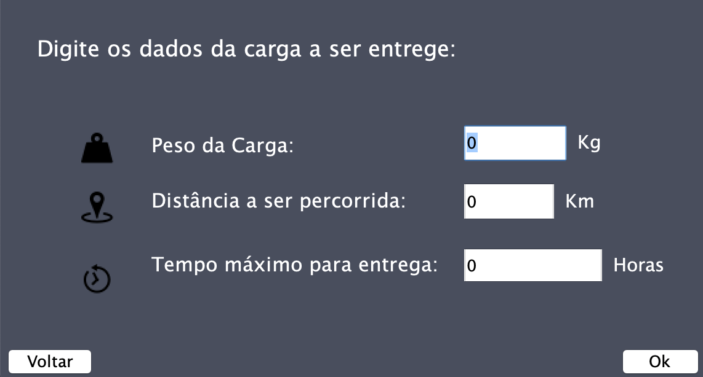
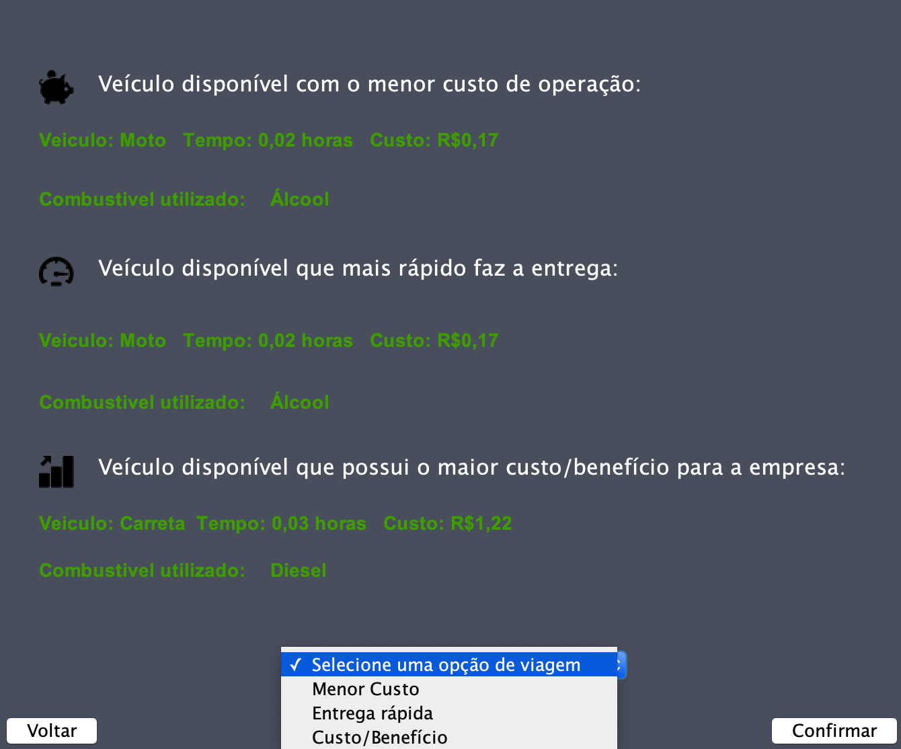
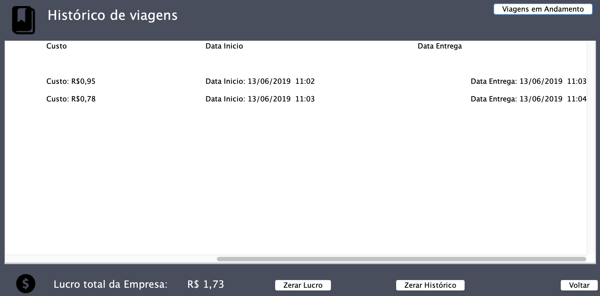
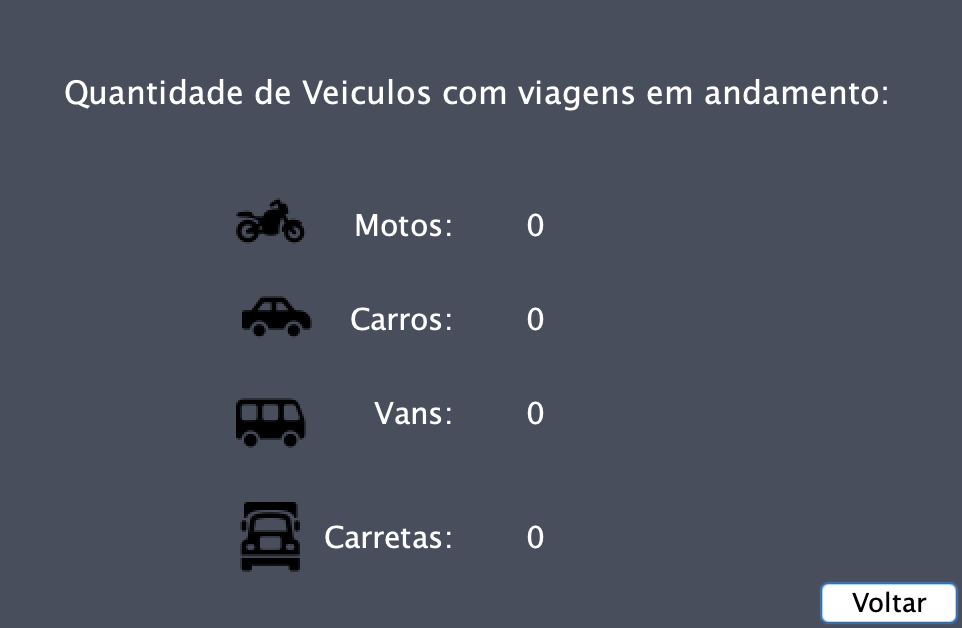
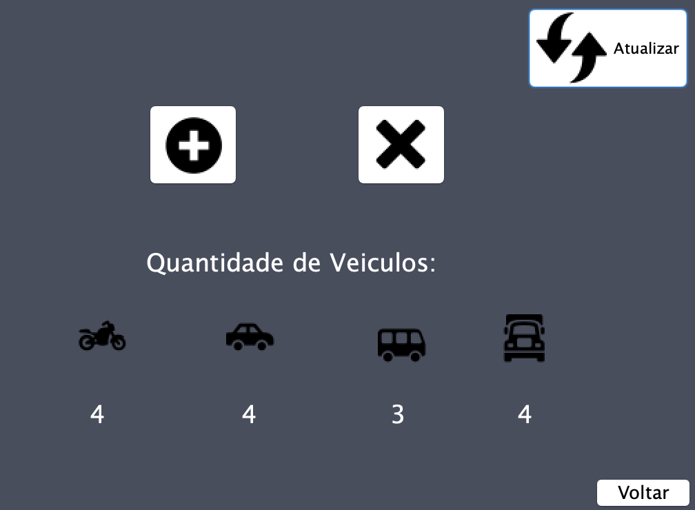
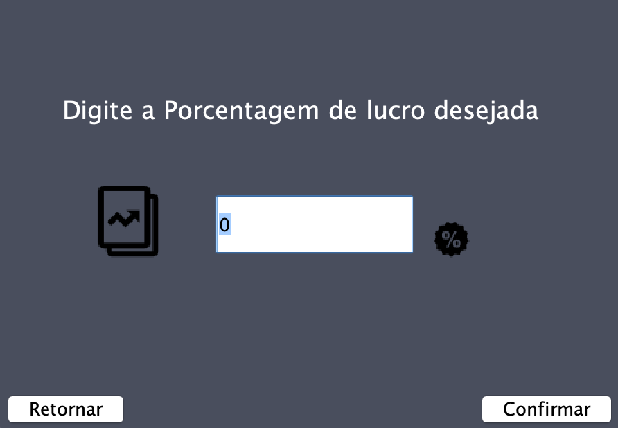
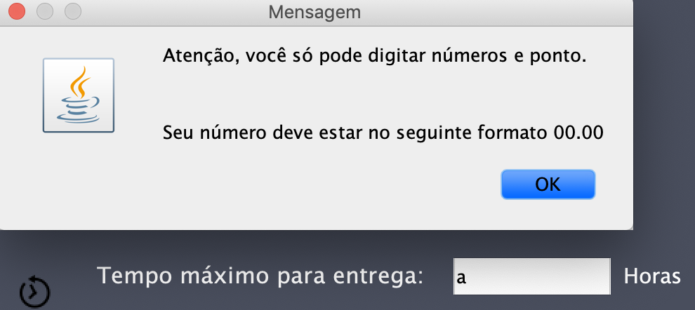

Charge X - EP2 OO 2019
===

Charge X é um software desenvolvido para automatizar tomadas de decisão visando apresentar as melhores escolhas de veículos para viagens em uma empresa de distribuição e também fazer o controle da frota de veículos, do histórico de viagens e do lucro da empresa.
---
Além disso, este programa conta com uma interface mais trabalhada e fácil de uso, para melhor experiência do usuário. Abaixo, está listado um guia e apresentação do aplicativo. 
----

* Esta é a janela principal do programa

* A **barra lateral de inicio** pertence aos botões que levam a outros jFrames que cumprem os requisitos do trabalho. Os botões servem respectivamente para iniciar nova entrega, visitar histórico de entregas, atualizar frota e atualizar margem de lucro.

* Esta janela é responsável por **colher os dados da nova entrega** e apresentar para a janela dos veículos escolhidos.

* Esta janela é responsável por **apresentar os veículos escolhidos para os 3 tipos de viagens** e **permitir que usuário escolha qual o tipo de viagem que irá escolher**.

* Esta janela é responsável por **apresentar o histórico de viagens** e também **permitir que o usuário zere o lucro, zere o histórico de viagens e visualize os veículos que estão executando viagem no momento**.

* Esta janela é responsável por **apresentar os veículos que estão indisponíveis na frota e estão executando viagens no momento.**

* Esta janela é responsável **pelo controle da frota, onde o usuário pode adicionar e remover veículos.** Obs: os veículos que estão realizando uma viagem não estarão na frota até finalizar suas viagens.

* E por fim, esta é a área onde o usuário pode **atualizar a margem de lucro da empresa.**

Algumas características sobre o projeto
---
* O Charge X foi feito para ser rodado 24 horas, pois persiste as viagens enquanto está rodando e faz as tomadas de decisão no inicio, durante e no fim das viagens.

* Para alertar o usuário do sistema do programa, quase todas as janelas apresentam paines de avisos ou informações sobre como o programa é executado. Uma delas é o botão de alerta e confirmação do encerramento do programa, que só é apresentado ao usuário caso ele tente fechar o programa com viagens sendo executadas. Veja a imagem abaixo:

Nesse caso, se o usuário confirma a saída, automaticamente seu veículo que estava executando a viagem retorna a frota e a viagem é finalizada.

* O charge X também foi pensado para usuários leigos, tomando tratamento de erro caso o usuário digite por exemplo caracteres indesejáveis nos devidos campos de dados, afinal, estamos preparados para qualquer tipo de usuário :)

* A cada viagem que é executada, o veículo escolhido é removido da frota enquanto a viagem é executada e após a viagem terminar ele é devolvido para a frota.

* Enquanto as viagens sao executadas, seus respectivos veículos são acrescentados em Veiculos em andamento. Você pode consultar quais veículos estão em viagem indo em "Histórico" e clicando no botão "Viagens em Andamento"."

* Toda vez que uma nova viagem é solicitada, o programa é dividido em 2 Threads (1 thread continuará executando o programa e a 2 thread pausará o programa até a viagem acabar e sobrescrever os arquivos devolvendo o veículo para a frota).

* O histórico de viagens é atualizado toda vez que uma viagem TERMINA.

* No histórico também é fornecido a data de Inicio e a data Final da viagem.

Dados do ambiente de desenvolvimento
---
* Sistema Operacional de desenvolvimento: iOS.

Log de versäo do java:

* java version "1.8.0_201"
* Java(TM) SE Runtime Environment (build 1.8.0_201-b09)
* Java HotSpot(TM) 64-Bit Server VM (build 25.201-b09, mixed mode)

Dados da IDE utilizada:

NetBeans 8.2

. O diagrama de classes (UML) foi gerado e editado através de um plug-in do Netbeans.

